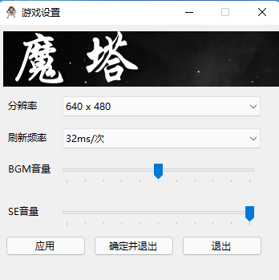
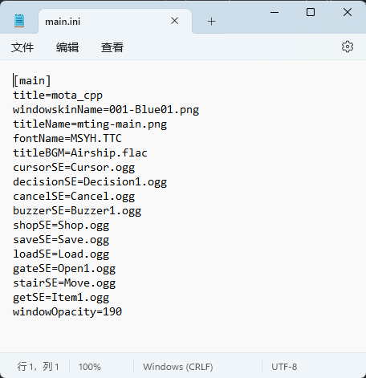

基础配置
=======

config.ini和Config.exe
~~~~~~~~~~~~~~~~~~~~~~~~~~

这里是游戏窗口的基础配置，可以调节窗口分辨率、刷新频率、游戏音量。

具体的工程参考 https://github.com/JasonLeon01/MotaConfig/ ，您可以修改并让Config.exe可以修改更多的配置。

main.ini
~~~~~~~~~~~~

这里是游戏部分配置的存储，您可以直接使用文本编辑器打开。

从上到下分别是：

.. csv-table:: 
    :header: "参数", "含义", "备注"
    :widths: 20, 50, 50

    "windowskinName", "窗口素材文件名", "存储于graphics\\system\\"
    "titleName", "标题背景文件名", "存储于graphics\\system\\"
    "fontName", "字体文件名", "存储于font\\"
    "titleBGM", "标题bgm", ""
    "cursorSE", "选择SE", ""
    "decisionSE", "确认SE", ""
    "cancelSE", "取消SE", ""
    "buzzerSE", "警告SE", ""
    "shopSE", "商店SE", ""
    "saveSE", "存档SE", ""
    "loadSE", "读档SE", ""
    "gateSE", "开门SE", ""
    "stairSE", "上下楼SE", ""
    "getSE", "获取物品SE", ""
    "windowOpacity", "窗口不透明度", "从0~255"
