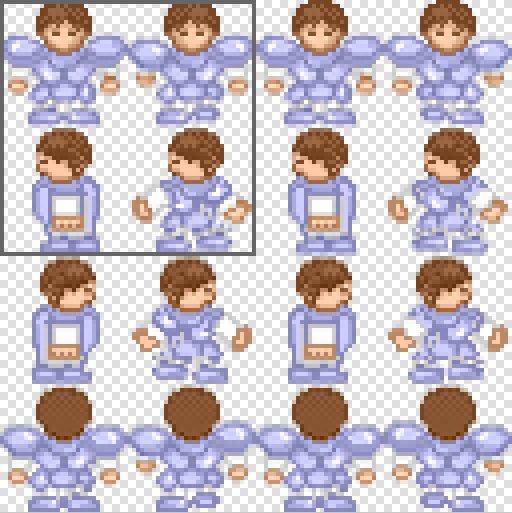

内部函数
========

这一部分可以参考 ``include\Game\stdafx.h`` 和 ``src\stdafx.cpp`` 文件内容。

quickPow(num,n)
~~~~~~~~~~~~~~~~~

快速幂计算，相比 ``<cmath>`` 自带的 ``pow`` 函数在计算整数的次幂方面更快。

print(content)
~~~~~~~~~~~~~~

用于提示文字类的消息，会在游戏界面出现一个弹窗。

ynPrint(content)
~~~~~~~~~~~~~~~~~

会在游戏界面出现一个确认弹窗，选择 **是/否** 会分别返回 **1/0** 。

str2wstr(str)
~~~~~~~~~~~~~~

会将传统的 ``string`` 字符串转换成 ``wstring`` 宽字符串。

vectorFind(source,target)
~~~~~~~~~~~~~~~~~~~~~~~~~~
判断一个 ``vector`` 是否包含某个对象，如果是非常规的自定义数据类型，需要重载 ``=`` 符号。

strInclude(source,target)
~~~~~~~~~~~~~~~~~~~~~~~~~~

判断字符串中是否含有某个子串，并返回结果。

strIncludeNum(source,target)
~~~~~~~~~~~~~~~~~~~~~~~~~~~~~

判断字符串中包含某子串的数量有 **多少个** ，并返回结果。

replaceAll(source,target,replacement)
~~~~~~~~~~~~~~~~~~~~~~~~~~~~~~~~~~~~~~~~

将字符串 ``source`` 中所有的 ``target`` 都替换为 ``replacement`` 。

allToInt(strArray)
~~~~~~~~~~~~~~~~~~~

可以将 ``strArray`` 的所有元素转换成 ``int`` 类型并返回。

insertNewLines(string,lineMax)
~~~~~~~~~~~~~~~~~~~~~~~~~~~~~~~~

在 ``string`` 中插入换行符，每隔 ``lineMax`` 个全角字符后会进行一次换行，如果遇到换行符会清空计数。

split(s,seperator)
~~~~~~~~~~~~~~~~~~~~

将一个字符串根据分割符分割成若干个子串，返回的是一个 ``vector<string>`` 类型的值。

arrayToString(arr, len)
~~~~~~~~~~~~~~~~~~~~~~~~

将一个字符串转换成以 ``,`` 分隔的字符串，返回的是一个 ``string`` 类型的值。

arrayToString(arr)
~~~~~~~~~~~~~~~~~~~

重载，将一个字符串转换成以 ``,`` 分隔的字符串，返回的是一个 ``string`` 类型的值，其中 ``arr`` 是 ``vector<int>`` 类型。

readFile(file)
~~~~~~~~~~~~~~

读取文件并按行分离成 ``vector<string>`` 。

readData(file,splt=":")
~~~~~~~~~~~~~~~~~~~~

根据本框架数据存储格式来读取数据信息，第二个参数默认为 ``":""`` ，也是一个分割符，用来分割数据名称和数据值。 假设一个数据文件的存储格式如下：

.. code-block:: cpp
    :linenos:

    [data]
    typeA:abc
    typeB:def

使用 ``readData`` 将会返回一个 ``map<string,string>`` 类型的值， ``map`` 的 ``key`` 是冒号前面的文字， ``value`` 是冒号后面的文字，假如返回值储存在 ``data`` 变量中，查询这个数据 ``typeA`` 的值就可以写成 ``data["typeA"]`` 。

但是注意，读取到的值都是 ``string`` 类型，如果储存的是数字，要读取的话，不要忘了使用 ``stoi`` 。

类似的，作为游戏配置文件的ini文件，格式也非常类似：

.. code-block:: cpp
    :linenos:

    [data]
    typeA=abc
    typeB=def

可以看出，冒号换成了等于号，所以在读取ini文件时，第二个参数设置成 ``"="`` 即可。

saveFile(file,content)
~~~~~~~~~~~~~~~~~~~~~~~~

存储单行文件，当然，你可以在 ``content`` 里面加上 ``\n`` 。

playSE(file)
~~~~~~~~~~~~

用来播放SE的函数。 ``file`` 部分直接写文件名即可，本函数会直接定向到 ``sound\`` 文件夹。

drawText
~~~~~~~~~

用于在屏幕上显示文字的函数，本函数有两个重载：

drawText(dx,dy,content,size,bond,Colour)
----------------------------------------------

.. csv-table:: 
    :widths: 20, 50

    "dx和dy", "xy坐标"
    "content", "为显示的文本"
    "size", "为字号，缺省值20"
    "bond", "为是否加粗，缺省值false"
    "colour", "为文字颜色，缺省值白色"

drawText(rect, content, pos, size, bond, colour)
-------------------------------------------------

.. csv-table:: 
    :widths: 20, 50
    
    "rect", "为坐标限制矩形，文字会根据pos确定自身的位置"
    "content", "为显示的文本"
    "pos", "为位置，0、1、2对应为左对齐、完全居中、右对齐，缺省值0"
    "size", "为字号，缺省值20"
    "bond", "为是否加粗，缺省值false"
    "colour", "为文字颜色，缺省值白色"

drawImage
~~~~~~~~~~

用于在屏幕上临时绘图的函数，本函数也有两个重载：

drawImage(file,x,y,opacity)
------------------------------

``file`` 为文件路径，需要注意，函数仅会定位至 ``graphics\`` 文件夹，后续文件夹需要标明。

若需要显示 ``system`` 文件夹里的 ``mting.png`` ， ``file`` 参数应写为 ``system\\mting.png`` ；

``x`` 和 ``y`` 为显示在的xy坐标；

``opacity`` 为显示的不透明度，缺省值255。

drawImage(file,x,y,rect,opacity)
------------------------------------

此重载的 ``file`` ,``x`` ,``y`` ,``opacity`` 和上面一致。

``rect`` 为显示时的裁剪矩形，想象图片本身是一个大矩形，现在要用一个小矩形去框选其中的一部分， ``rect`` 的四个参数分别是 ``sx``, ``sy`` , ``width``, ``height`` ，用于截选图片中的一部分。
