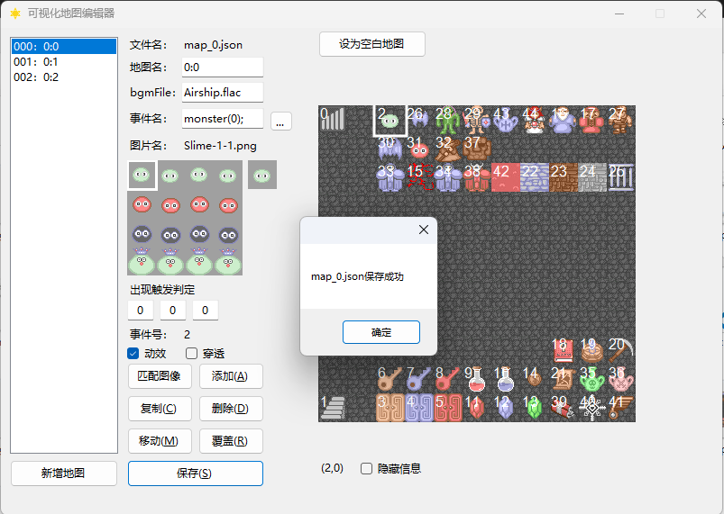
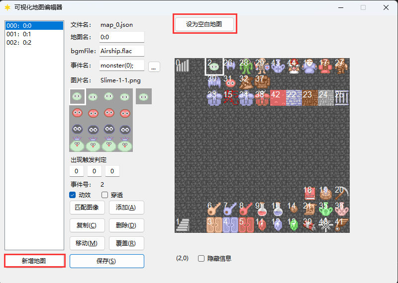
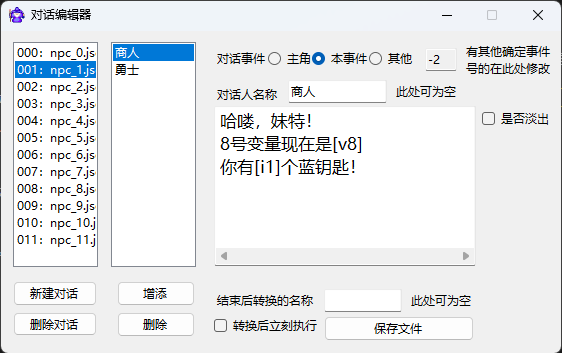

工具说明
=======

本节下的所有内容均存于 ``tools\`` 文件夹下，本文件夹可改名，但是一定要保证下列工具在 ``data\`` 和 ``graphics\`` 所在路径的再往下一层。

.. hint:: 在各编辑器里修改的名称等数据需要保存之后才会在UI中更新。

可视化地图编辑器MapDesigner.exe
~~~~~~~~~~~~~~~~~~~~~~~~~~~~~~

.. image:: sample_1.png
   :align: center
   :alt: 可视化地图编辑器MapDesigner.exe

这里可以对游戏地图进行绘制。

事件名称介绍
-----------

可以看到，每个地图上的元素都由事件构成，而事件执行什么内容，会依托事件名，这里提供了几种基础的事件，如果有更多的需要，可以在 ``gamedata.cpp`` 的 ``GameEvent::order()`` 函数中自己定义。

每种事件的不同编号依托 ``/`` 号区分，如果您希望在事件执行结束后对某个变量（本文仅代指 ``motaVariables.variables`` ）进行更改，可以在事件名后面添加 ``|`` 号，设置事件名为 ``name|x|y`` ， ``x`` 为更改的变量ID， ``y`` 为该变量的增量。

例如，想要执行完 ``npc/1`` 事件后对10号变量+1，则可以设为 ``npc/1|10|1`` 。

事件名可以使用 ``<>`` 分隔，代表同一事件执行若干个事件指令，比如执行钥匙盒类型，就是 ``item/0/1<>item/1/1<>item/2/1`` ，注意，由 ``<>`` 分隔只是执行多个指令，但是是在同一批次执行的，如果要实现对话完之后得到宝物，还是要采用NPC对话编辑器的 :guilabel:`结束后转换的名称` 方法。

.. hint::  ``<>`` 分隔符为第一顺序！切勿在 ``condition`` 和 ``switch`` 中使用 ``<>`` ，否则会导致错误！！！

下面展示目前提供的事件名称：

墙壁类
^^^^^^

其实并没有固定的命名格式，因为墙壁仅仅是没有 ``order`` 的事件而已，任何不存在于 ``order()`` 函数里的名称均可作为墙壁，不过本框架中约定为 ``wall`` ，因为这个名称才可以被破墙镐、地震卷轴消去。

同理的，岩浆的名字设为 ``fire`` ，这样才能被冰冻徽章消去。

怪物类
^^^^^^

怪物类的命名方式为 ``monster/x`` ， ``x`` 代表的是怪物编号。

宝石血瓶类
^^^^^^^^^

也就是能力值增加的事件，命名方式为： ``bonus/x/y`` ，其中 ``y`` 为增加的数值，而 ``x`` 代表的内容如下所示：

.. csv-table:: bonus事件x值对应参考
    :header: "x", "0", "1", "2", "3", "4", "5", "6"
    :widths: 20, 30, 30, 30, 30, 30, 30, 30

    "代表", "生命值", "攻击力", "防御力", "魔防", "经验", "金币", "等级"

其中，等级遵循新新魔塔的升级加点，同时会提升 ``400/5/5 * val`` 的各维能力。

门类
^^^^

命名方式为 ``door/x`` ，其中x为门的编号， ``x`` 代表的内容如下所示：

.. csv-table:: door事件x值对应参考
    :header: "x", "0", "1", "2", "3"
    :widths: 20, 30, 30, 30, 30

    "代表", "暗墙", "黄门", "蓝门", "红门"

.. hint:: “暗墙”不一定是墙，也可以是一推就倒的门，比如类机关门、新新魔塔入口处的铁门，均可用这个事件。

物品类
^^^^^^

命名方式为 ``item/x/y`` ，其中 ``x`` 为物品编号， ``y`` 为获取数量。

比如 *获取1把黄钥匙（0号物品）* 的事件名为 ``item/0/1`` 。

路障类（熔岩）
^^^^^^^^^^^^

命名方式为 ``lava/x`` ，其中 ``x`` 为造成的伤害。

商店类
^^^^^^

命名方式为 ``shop/x/y`` ，其中 ``x`` 为商店类型， *0* 为金币商店（默认是新新魔塔类商店，可以通过 ``src\main.cpp`` 的 ``WindowShop`` 类进行更改）， *1* 为经验商店（同样也是默认为新新魔塔类商店）， ``y`` 为商店编号，用于计算价格。

其中，商店价格数组在 ``motaTemp`` 里面进行初始化，y的值对应数组的下标，本框架默认的金币商店初始价格为 ``[20,50]`` ，增加的能力值为 ``[300*y+500,3*y+3,3*y+3]`` 经验商店的价格是 ``[120*y+70,30*y+20,30*y+20]`` ，增加的能力值为 ``[2*y+1,2*y+1,3*y+2]`` ，当然，这些计算方式您都可以自行调节。

上下楼
^^^^^^^

这个非常简单，就是对应 ``up`` 和 ``down`` ，其中是含有上下楼动画的，这些您可以自行调整或者取消，上下楼动画为 ``graphics\system\mting.png`` 文件。

如果你在后面添加信息，比如 ``up/x/y`` ，这就会将你传送至楼上的指定xy坐标，否则，将不会变更坐标。

传送
^^^^

命名方式为 ``move/m/x/y`` ，其中 ``m`` 为传送去的地图编号， ``x,y`` 为传送到的x,y坐标。

NPC
^^^^

NPC的命名方式为 ``npc/x`` ，会自动寻找数据库里的npc数据完成对话，这一部分的编辑在 **对话编辑器** 里面可以了解。

修改变量
^^^^^^^

修改变量的命名方式为 ``var/x/y`` ，会将 ``x`` 号变量增加 ``y`` ，一般用于内置的其他代码使用，而不用于地图上。

返回标题
^^^^^^^^

返回标题的指令是 ``back`` ，会返回标题画面，一般用于内置的其他代码使用，而不用于地图上。

条件类型★
^^^^^^^^^^

条件类型的命名和之前都不一样，需要格外注意。

命名方式为 ``condition~x~y~z~p~q`` ，注意这里是 **~** 。

其中 ``x`` 为依托的条件，比如233号变量， ``x`` 就是 ``[233]`` ，这里和对话类型的替换完全一致。

``y`` 为条件，目前可以填写为 "=="、">="、"<="、">"、"<"、"!=" ，分别对应等于、大于等于、小于等于、大于、小于、不等于。

``z`` 为比较的值，比如233号变量等于10，那么 ``z`` 就是 ``10``

``p`` 为条件成立时的事件，比如233号变量等于10时，执行事件名为 ``p`` 的事件，如果是有事件列表，则用 ``->`` （ **区分于 =>** ）分隔。

``q`` 为条件不成立时的事件，比如233号变量不等于10时，执行事件名为 ``q`` 的事件，如果是有事件列表，则用 ``->`` （ **区分于 =>** ）分隔。

消除事件★★
^^^^^^^^^^^

命名方式为 ``erase`` ，会消去 ``motaTemp.functionEventID`` 所记录的事件，一般用于对话中。

转换事件名★★★
^^^^^^^^^^^^^^^

命名方式为 ``switch~x`` ，同样注意是 **~** 分隔，会将本事件的事件名转换成 ``x``。

.. hint:: 切记请勿和condition混用，否则会导致错误！

行走图
------

.. image:: sample_3.png
   :align: center
   :alt: 行走图

这里决定了事件的行走图以及在行走图上对应的位置，行走图素材严格按照128*128的标准，在区域内按下鼠标右键可以选择图片，按下鼠标左键可以选择位置。

出现触发判定
-----------

.. image:: sample_5.png
   :align: center
   :alt: 出现触发判定

这里决定的是事件出现或者可以被触发的条件，三个格子分别为类型/编号/值。

其中，类型分为：

.. csv-table:: 出现触发条件第一格对应参考
    :header: "值", "0", "1", "2"
    :widths: 20, 30, 30, 30

    "代表", "无条件", "满足条件出现", "满足条件触发"

一般的无条件事件，填写0/0/0即可，也就是默认的条件。

如果您想制作一个击败若干敌人会出现的事件，比如宝物等，例如，6号变量等于7时出现，就要设为 ``1/6/7`` 。

如果您想制作一个机关门，在8号变量等于9时可以打开，那就要设为 ``2/8/9`` 。

其余设置
--------

地图名
^^^^^^

.. image:: sample_6.png
   :align: center
   :alt: 地图名

顾名思义，就是这个地图的名称，一般的魔塔楼层命名规则为 ``x:y`` ， ``x`` 是魔塔编号，默认从0开始， ``y`` 是楼层数。

满足此规则的将会在状态栏处显示 ``魔塔y层`` （可在 ``motaName.ini`` 处自行更改），不满足的将会显示本身设置的地图名，比如密室等。

地图BGM
^^^^^^^

.. image:: sample_7.png
   :align: center
   :alt: 地图BGM

当前地图使用的BGM文件名，暂时不支持预览模式。

动效
^^^^

.. image:: sample_8.gif
   :align: center
   :alt: 动效

一般用于区分怪物/NPC事件和物品事件，对应RMXP的 :guilabel:`停止时动画` ，如果是怪物等，勾选上即可。

穿透
^^^^

决定这个事件是否可以被穿过，一般用于扣血路障等事件。

隐藏信息
^^^^^^^^

.. image:: sample_10.gif
   :align: center
   :alt: 隐藏信息

勾选可以隐藏在地图编辑器上显示的事件编号，更直观地看到在游戏中的样子。

匹配图像
^^^^^^^

.. image:: sample_11.gif
   :align: center
   :alt: 匹配图像

根据事件名匹配图像及其位置，会自动匹配的有monster、item事件，其余列表可以参考 ``DesignerReferrence.txt`` ，您可以按照格式自行更改。

如何布置事件
-----------

添加
^^^^

.. image:: sample_12.gif
   :align: center
   :alt: 添加

可以将左侧的事件信息添加到地图上选中的格子，也可以在 **地图上点击** :guilabel:`鼠标右键` 快速布置。

复制
^^^^

.. image:: sample_13.gif
   :align: center
   :alt: 复制

可以将地图上选中的格子的事件信息复制到左侧事件信息栏，同时也会显示复制的事件号，同时，在 **地图上点击** :guilabel:`鼠标左键` 即可快速复制。

删除
^^^^

.. image:: sample_14.gif
   :align: center
   :alt: 删除

可以将地图上选中的格子的事件进行删除，后面的事件编号将会向前挪一位，也可以 **在地图上点击** :guilabel:`鼠标中键` 快速删除。

移动
^^^^

.. image:: sample_15.gif
   :align: center
   :alt: 移动

可以将复制事件号对应的事件移动到地图上选中格子的位置。

覆盖
^^^^

.. image:: sample_16.gif
   :align: center
   :alt: 覆盖

将选中的格子上的事件信息更改为左侧事件信息栏的内容。

保存
^^^^

会保存当前页面的地图，保存成功后会弹出一个窗口，是本地图所有信息的一个列表。

新增地图 & 设为空白地图
^^^^^^^^^^^^^^^^^^^^^^

最新一期新增内容

新增地图
""""""""

会在列表中新增一个地图，默认按照当前的空白地图模板 ``blankmap.dat`` 进行初始化。

设为空白地图
"""""""""""""

会将当前地图的信息整合起来存入 ``blankmap.dat`` 。

动画编辑器AnimationDesigner.exe
~~~~~~~~~~~~~~~~~~~~~~~~~~~~~~~

这里可以对游戏动画进行绘制，支持的动画 **单个图片** 规格的动画素材（需要是透明底图）。

.. image:: sample_19.png
   :align: center
   :alt: 保存

使用方法和RMXP的动画编辑器类似，不过极大简化了，每一帧的动画通过右上角按钮设置，默认的原点坐标都在中心点。

RMXP动画素材分离器AnimationSeparator.exe
~~~~~~~~~~~~~~~~~~~~~~~~~~~~~~~~~~~~~~~

这里可以对RMXP规格的动画素材分离成若干192 * 192的素材，并保存在原路径中。

.. image:: sample_20.png
   :align: center
   :alt: 保存

使用方法也很简单，导入 -> 点击分离，即可，在点击分离之后会自动将分离的素材放置到原路径中，文件名为 ``原文件名_x`` ， ``x`` 为下标，表示顺序。

.. hint:: 由于原RMXP的动画素材未必会填充满整行，所以可能出现保存了几个透明的空图片的情况，这种时候自行删除多余图片即可。

NPC对话编辑器NPCDesigner.exe
~~~~~~~~~~~~~~~~~~~~~~~~~~~~

这里可以对游戏内NPC的对话内容进行设置。

文字要求
--------

所有字符须使用 **全角** 字符， **不能** 使用 **半角** 字符。

如何添加选择项？
^^^^^^^^^^^^^^^

选择项单起一行，在最前面加上 ``[s]`` ，代码就会识别出来这是选择项了，并且会出现光标矩形。

例如：

.. code-block:: cpp
    :linenos:

    你好，你要选择什么？
    [s]1攻击
    [s]1防御

选择项选中之后的对应指令要如何加上呢？
^^^^^^^^^^^^^^^^^^^^^^^^^^^^^^^^^^^

本框架所有事件指令均依托于事件名，在选择项内容描述完之后加上 ``=>`` ，多个事件用多个 ``=>`` 分隔，然后写上需要执行的事件名，之后就会创建一个“临时事件”的列表并执行相关指令。

.. image:: sample_23.png
   :align: center
   :alt: 选择项指令

例如：

.. code-block:: cpp
    :linenos:

    你好，你要选择什么？
    [s]1攻击=>bonus/1/2
    [s]1防御=>bonus/2/2

演示效果如下：

何谓全角字符和半角字符？
^^^^^^^^^^^^^^^^^^^^^^

举最简单的例子，所有的汉字和中文标点为 **全角** ，一般情况下的英文和数字字符为 **半角** 字符。

如何让半角字符转换为全角字符？
^^^^^^^^^^^^^^^^^^^^^^^^^^^

一般的输入法，全半角转换的快捷键为 ``shift+space`` ，微软拼音输入法打开快捷键的方法为： 找到任务栏 :guilabel:`中/英` 字样 -> 右键点击 :guilabel:`选择设置` -> :guilabel:`按键` -> :guilabel:`全/半角切换` 。

禁用词
------

不允许在文字框内填写 ``none`` ，因为这个是占位用的，出现后会立刻跳出提示，对话框不允许在半角方括号 ``[]`` 内插入数字和英文字母 ``s`` 以外的文本。

事件编号
--------

为本段对话中说话的对象编号，用来确认头像，当前主角说话为 ``-1`` ，当前触发事件为 ``-2`` ，这两项均可用按钮确认，会自动填写，其余情况为地图上对应的事件编号。

在对话中插入当前游戏某变量的值
---------------------------

在对话中插入 ``x`` 号变量的方法为写成 ``[x]`` ，代码会自动识别半角方括号里的内容，并读取当前变量的值进行替换。

在对话中插入角色各项能力数值的方法写成 ``[能力名称]`` ，比如角色的攻击力写成 ``[atk]`` 。

效果演示如下：

.. image:: sample_25.png
   :align: center
   :alt: 插入变量演示

魔塔怪物编辑器EnemyDesigner.exe
~~~~~~~~~~~~~~~~~~~~~~~~~~~~~

这里可以对游戏内怪物的能力以及属性进行设置。

.. image:: sample_26.png
   :align: center
   :alt: 怪物编辑器

怪物名称格式
------------

带有buff属性的怪物名称必须要以 ``/`` 分割，例如 ``绿史莱姆/1`` ， ``/`` 后面的内容代表buff的效果。

下面列出几种常见的buff效果及其命名格式：

.. csv-table:: 
      :header: "效果", "命名格式"
      :widths: 20, 50

      "中毒", "整数，代表增加易伤的百分数"
      "衰弱", "整数，代表削减攻防的值"
      "吸血", "小数，代表吸血的百分比"
      "再生", "整数，代表复活成为的怪物编号"

怪物属性
--------

勾选想要赋予的属性即可，点击相对应栏可以查看其描述，直接在描述框修改描述即可。

对于带有数值的属性描述，比如 *战斗后，会附加若干点衰弱效果* ，这个 *若干点* 要替换为 ``[v]`` ，在游戏中会按怪物属性从上到下读取，需要 ``[v]`` 的地方会读取怪物名称 ``/`` 分隔后第二个开始往后的数值。

比如怪物名设置为 ``红衣魔王/1/2`` ，拥有中毒和衰弱两个属性，属性描述均带有 ``[v]`` ，游戏中会自动将 ``1`` 设为中毒的 ``[v]`` ， ``2`` 设为衰弱的 ``[v]`` 。

打包工具Packager.exe
~~~~~~~~~~~~~~~~~~~~

这个可以将你的工程打包为一个rar文件，要打包的项目可以在 ``package.txt`` 里面进行设置。

其中，文件夹需要以 ``\`` 结尾，文件则无要求。
