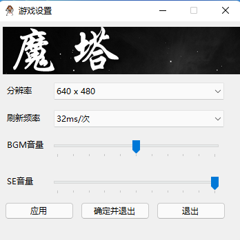
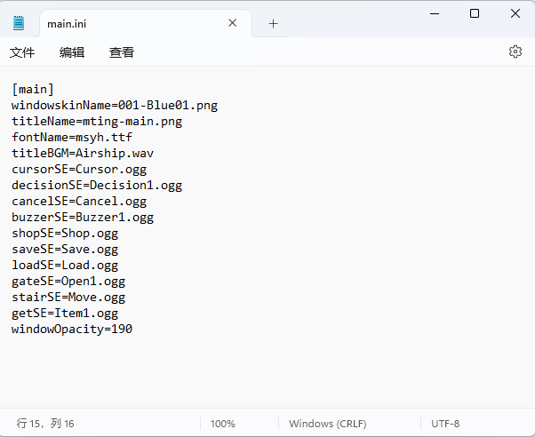

基础配置
=====

config.ini和Config.exe
------------

这里是游戏窗口的基础配置，可以调节窗口分辨率、刷新频率、游戏音量。

具体的工程参考 https://github.com/JasonLeon01/MotaConfig/ ，您可以修改并让Config.exe可以修改更多的配置。

main.ini
----------------

这里是游戏部分配置的存储，您可以直接使用文本编辑器打开。

从上到下分别是：

windowskinName：窗口素材文件名，存储于 ``graphics\system\``

titleName：标题背景文件名，存储于 ``graphics\system\``

fontName：字体文件名，存储于 ``font\``

titleBGM为标题bgm

cursorSE为选择SE

decisionSE为确认SE

cancelSE为取消SE

buzzerSE为警告SE

shopSE为商店SE

saveSE为存档SE

loadSE为读档SE

gateSE为开门SE

stairSE为上下楼SE

getSE为获取物品SE

上述音效均存储于 ``sound\``

windowOpacity为窗口不透明度，从0~255
