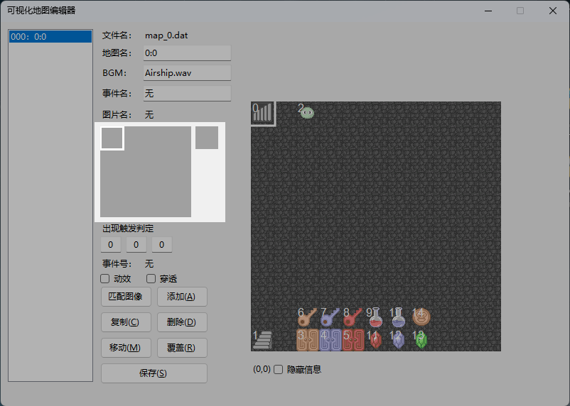
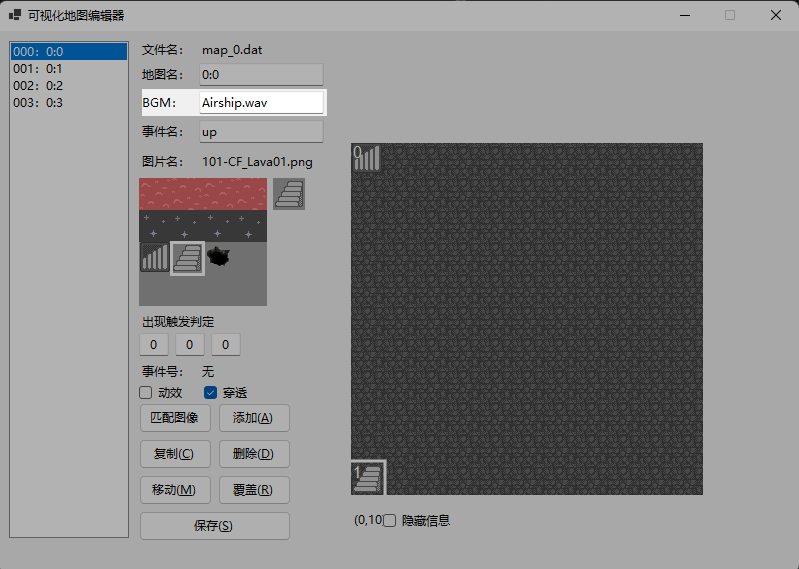
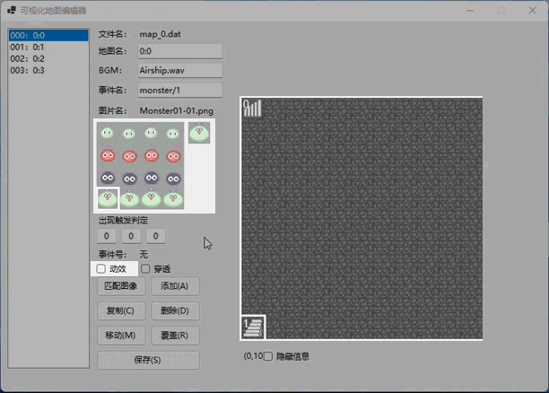
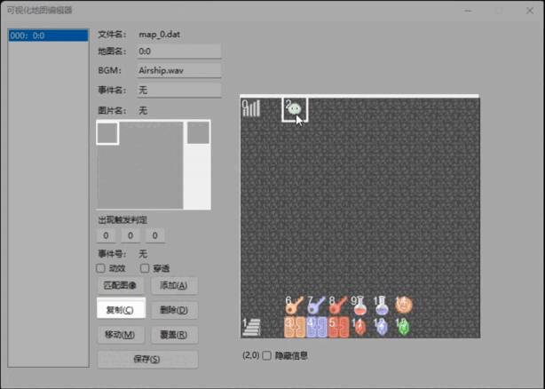

工具说明
=======

1. 可视化地图编辑器MapDesigner.exe
~~~~~~~~~~~~~~~~~~~~~~~~~~~~~~~~~~

.. image:: sample_3.png
   :align: center
   :alt: 可视化地图编辑器MapDesigner.exe

这里可以对游戏地图进行绘制。

1.1. 如何创建新地图
-----------------

在 ``data\map\`` 处可以看到一个叫做 ``blankmap.dat`` 的文件，这就是空白地图，复制粘贴之后将文件名改为 ``map_x.dat`` 即可，需要注意所有的 ``map_x.dat`` 的 ``x`` 必须连贯且从0开始，否则地图编辑器将无法识别中断处之后的地图。

1.2. 事件名称介绍
---------------

可以看到，每个地图上的元素都由事件构成，而事件执行什么内容，会依托事件名，这里提供了几种基础的事件，如果有更多的需要，可以在 ``gamedata.cpp`` 的 ``GameEvent::order()`` 函数中自己定义。

每种事件的不同编号依托/号区分，下面展示目前提供的事件名称：

1.2.1. 墙壁类
^^^^^^^^^^^^

其实并没有固定的命名格式，因为墙壁仅仅是没有 *order* 的事件而已，任何不存在于 ``order()`` 函数里的名称均可作为墙壁，不过本框架中约定为 ``wall`` 。

1.2.2. 怪物类
^^^^^^^^^^^^

怪物类的命名方式为 ``monster/x`` ， ``x`` 代表的是怪物编号。

.. hint:: 如果您希望在战斗后对游戏内的变量（本文仅代指 ``motaVariables.variables`` ）进行更改，可以将怪物名字命名为 ``monster/x/y/z`` ，代表着在与 ``x`` 号怪物战斗之后，将会对 ``y`` 号变量增加 ``z`` （z可以为负，代表着减少）。

1.2.3. 宝石血瓶类
^^^^^^^^^^^^^^^^

也就是能力值增加的事件，命名方式为： ``bonus/x/y`` ，其中 ``y`` 为增加的数值，而 ``x`` 代表的内容如下所示：

.. csv-table:: bonus事件x值对应参考
    :header: "x", "0", "1", "2", "3", "4", "5"
    :widths: 20, 30, 30, 30, 30, 30, 30

    "代表", "生命值", "攻击力", "防御力", "魔防", "经验", "金币"

1.2.4. 门类
^^^^^^^^^^

命名方式为 ``door/x`` ，其中x为门的编号， ``x`` 代表的内容如下所示：

.. csv-table:: door事件x值对应参考
    :header: "x", "0", "1", "2", "3"
    :widths: 20, 30, 30, 30, 30

    "代表", "暗墙", "黄门", "蓝门", "红门"

.. hint:: “暗墙”不一定是墙，也可以是一推就倒的门，比如类机关门、新新魔塔入口处的铁门，均可用这个事件。

1.2.5. 物品类
^^^^^^^^^^^^

命名方式为 ``item/x/y`` ，其中 ``x`` 为物品编号， ``y`` 为获取数量。

比如 *获取1把黄钥匙（0号物品）* 的事件名为 ``item/0/1`` 。

1.2.6. 路障类（熔岩）
^^^^^^^^^^^^^^^^^^

命名方式为 ``lava/x`` ，其中 ``x`` 为造成的伤害。

1.2.7. 商店类
^^^^^^^^^^^^

命名方式为 ``shop/x/y`` ，其中 ``x`` 为商店类型， *0* 为金币商店（默认是新新魔塔类商店，可以通过 ``main.cpp`` 的 ``WindowShop`` 类进行更改）， *1* 为经验商店（同样也是默认为新新魔塔类商店）， ``y`` 为商店编号，用于计算价格。

其中，商店价格数组在 ``motaTemp`` 里面进行初始化，y的值对应数组的下标，本框架默认的金币商店初始价格为 ``[20,50]`` ，增加的能力值为 ``[300*y+500,3*y+3,3*y+3]`` 经验商店的分别价格是 ``[[70,20,20],[190,50,50]]`` ，增加的能力值为 ``[2*y+1,2*y+1,3*y+2]`` ，当然，这些计算方式您都可以自行调节。

1.2.8. 上下楼
^^^^^^^^^^^^

这个非常简单，就是对应 ``up`` 和 ``down`` ，其中是含有上下楼动画的，这些您可以自行调整或者取消，上下楼动画为 ``graphics\system\mting.png`` 文件。

1.2.9. 传送
^^^^^^^^^^

命名方式为 ``move/m/x/y`` ，其中 ``m`` 为传送去的地图编号， ``x,y`` 为传送到的x,y坐标。

1.2.10. NPC
^^^^^^^^^^^

NPC的命名方式为 ``npc/x`` ，会自动寻找数据库里的npc数据完成对话，这一部分的编辑在 **对话编辑器** 里面可以了解。

1.3. 行走图
----------

这里决定了事件的行走图以及在行走图上对应的位置，行走图素材严格按照128*128的标准，在区域内按下鼠标右键可以选择图片，按下鼠标左键可以选择位置。

.. image:: sample_6.png
   :align: center
   :alt: 选择图片

1.4. 出现触发判定
---------------

这里决定的是事件出现或者可以被触发的条件，三个格子分别为类型/编号/值。

其中，类型分为：

.. csv-table:: 出现触发条件第一格对应参考
    :header: "值", "0", "1", "2"
    :widths: 20, 30, 30, 30

    "代表", "无条件", "满足条件出现", "满足条件触发"

一般的无条件事件，填写0/0/0即可，也就是默认的条件。

如果您想制作一个击败若干敌人会出现的事件，比如宝物等，例如，6号变量等于7时出现，就要设为 ``1/6/7`` 。

如果您想制作一个机关门，在8号变量等于9时可以打开，那就要设为 ``2/8/9`` 。

1.5. 其余设置
------------

1.5.1. 地图名
^^^^^^^^^^^^

顾名思义，就是这个地图的名称，一般的魔塔楼层命名规则为 ``x:y`` ， ``x`` 是魔塔编号，默认从0开始， ``y`` 是楼层数。

满足此规则的将会在状态栏处显示 ``魔塔y层`` （可在 ``ScreenData::mapStatus()`` 处自行更改），不满足的将会显示本身设置的地图名，比如密室等。

1.5.2. 地图BGM
^^^^^^^^^^^^^

当前地图使用的BGM文件名，暂时不支持预览模式。

1.5.3. 动效
^^^^^^^^^

一般用于区分怪物/NPC事件和物品事件，对应RMXP的 ``停止时动画`` ，如果是怪物等，勾选上即可。

1.5.4. 穿透
^^^^^^^^^^

决定这个事件是否可以被穿过，一般用于扣血路障等事件。

1.5.5. 隐藏信息
^^^^^^^^^^^^^

勾选可以隐藏在地图编辑器上显示的事件编号，更直观地看到在游戏中的样子。

1.5.6. 匹配图像
^^^^^^^^^^^^^

根据事件名匹配图像及其位置，会自动匹配的有 ``monster, item`` 事件，其余列表可以参考 ``DesignerReferrence.txt`` ，您可以按照格式自行更改。

1.6. 如何布置事件
---------------

1.6.1. 添加
^^^^^^^^^^

可以将左侧的事件信息添加到地图上选中的格子，也可以在 **地图上点击鼠标右键** 快速布置。

1.6.2. 复制
^^^^^^^^^^

可以将地图上选中的格子的事件信息复制到左侧事件信息栏，同时也会显示复制的事件号。

1.6.3. 删除
^^^^^^^^^^

可以将地图上选中的格子的事件进行删除，后面的事件编号将会向前挪一位，也可以 **在地图上点击鼠标中键** 快速删除。

1.6.4. 移动
^^^^^^^^^^

可以将 ``复制事件号`` 对应的事件移动到地图上选中格子的位置。

1.6.5. 覆盖
^^^^^^^^^^

将选中的格子上的事件信息更改为左侧事件信息栏的内容。

1.6.6. 保存
^^^^^^^^^^

会保存当前页面的地图，保存成功后会弹出一个窗口，是本地图所有信息的一个列表。

2. 动画编辑器AnimationDesigner.exe
~~~~~~~~~~~~~~~~~~~~~~~~~~~~~~~~~~

这里可以对游戏动画进行绘制，支持的动画 **单个图片** 规格的动画素材（需要是透明底图）。

.. image:: sample_20.png
   :align: center
   :alt: 保存

使用方法和RMXP的动画编辑器类似，不过极大简化了，每一帧的动画通过右上角按钮设置，默认都在中心点。

3. RMXP动画素材分离器AnimationSeparator.exe
~~~~~~~~~~~~~~~~~~~~~~~~~~~~~~~~~~~~~~~~~~

这里可以对RMXP规格的动画素材分离成若干192 * 192的素材，并保存在原路径中。

使用方法也很简单，导入 -> 点击分离，即可，在点击分离之后会自动将分离的素材放置到原路径中，文件名为 ``原文件名_x`` ， ``x`` 为下标，表示顺序。

.. hint:: 由于原RMXP的动画素材未必会填充满整行，所以可能出现保存了几个透明的空图片的情况，这种时候自行删除多余图片即可。

4. NPC对话编辑器NPCDesigner.exe
~~~~~~~~~~~~~~~~~~~~~~~~~~~~~~~

这里可以对游戏内NPC的对话内容进行设置。
