# 工具说明

本节下的所有内容均存于 ``tools\`` 文件夹下，本文件夹可改名，但是一定要保证下列工具在 ``data\`` 和 ``assets\`` 所在路径的再往下一层。

- 在各编辑器里修改的名称等数据需要保存之后才会在UI中更新。

## 可视化地图编辑器MapDesigner.exe


这里可以对游戏地图进行绘制。

### 事件名称介绍

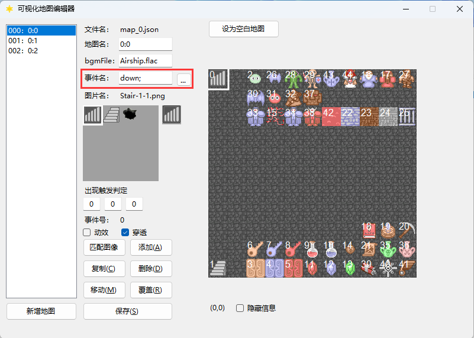

可以看到，每个地图上的元素都由事件构成，而事件执行什么内容，会依托事件名，这里提供了几种基础的事件，
如果有更多的需要，可以在 ``gamedata.cpp`` 的 ``GameEvent::order()`` 函数中自己定义。

事件名可以使用 ``;`` （半角）分隔，末尾也需要有该符号，否则无法识别。

代表同一事件执行若干个事件指令，比如执行钥匙盒类型，就是 ``item(0,1);item(1,1)item(2,1)`` 。

可以看出，事件名DSL的格式是类函数格式的，请务必保证括号对齐，否则会出现错误，当然，在使用不需要“参数”的DSL例如墙壁时，可以省略括号。

您也可以点击事件名称右侧的 :`...` 按钮，会弹出一个编辑框，可以直接编辑事件名称，编辑完之后点击 `完成` 即可，想具体了解DSL格式的可以参考后续相关介绍。

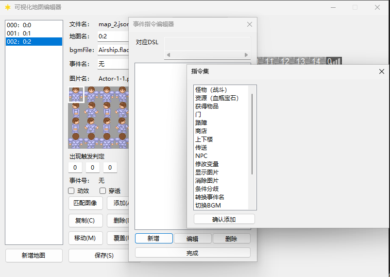

### 行走图

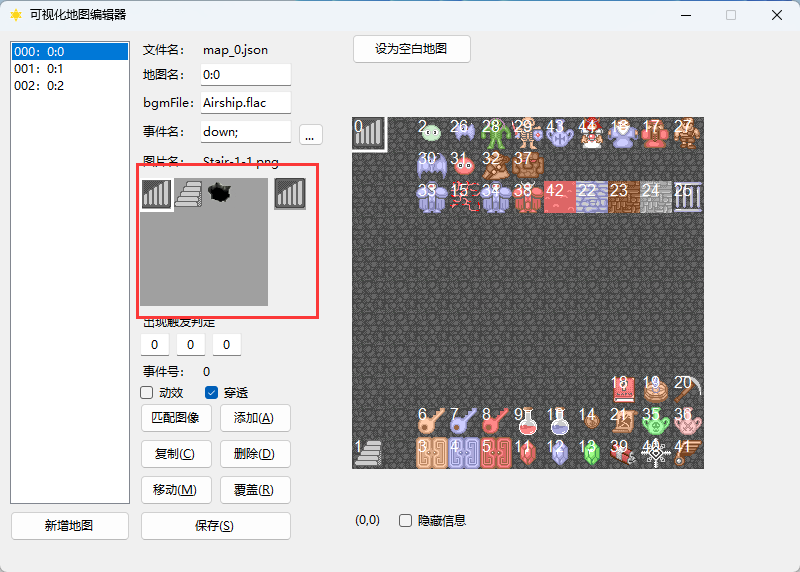

这里决定了事件的行走图以及在行走图上对应的位置，行走图素材严格按照128*128的标准，在区域内按下鼠标右键可以选择图片，按下鼠标左键可以选择位置。

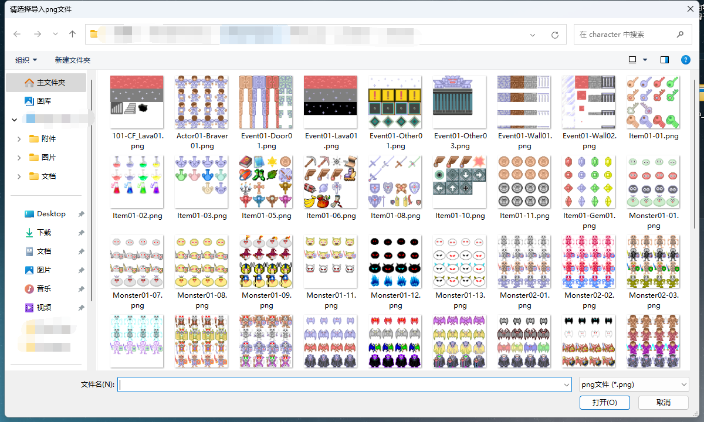

### 出现触发判定

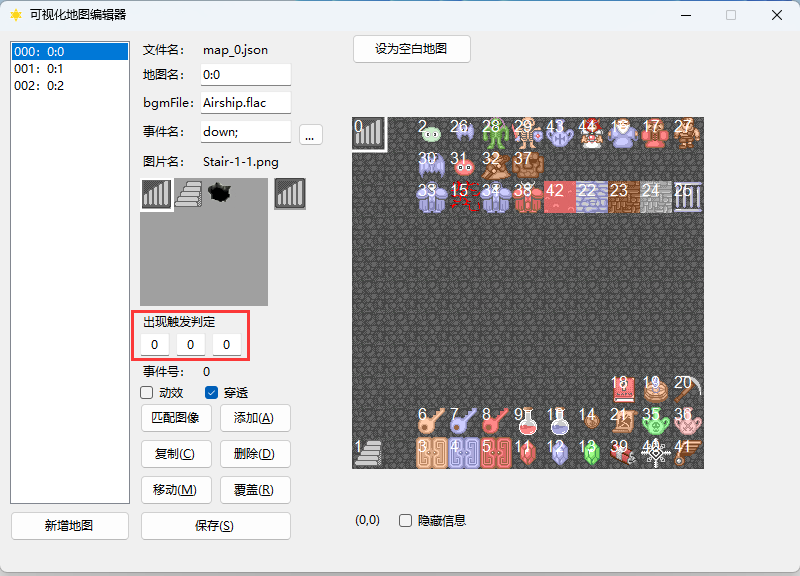

这里决定的是事件出现或者可以被触发的条件，三个格子分别为类型/编号/值。

其中，类型分为：

| 值 | 0 | 1 | 2 | 3 |
|---|---|---|---|---|
| 代表 | 无条件 | 满足条件出现 | 满足条件后接触触发 | 满足条件后自动触发 |

一般的无条件事件，填写0/0/0即可，也就是默认的条件。

如果您想制作一个击败若干敌人会出现的事件，比如宝物等，例如，6号变量等于7时出现，就要设为 ``1/6/7`` 。

如果您想制作一个机关门，在8号变量等于9时可以打开，那就要设为 ``2/8/9`` 。

### 地图名

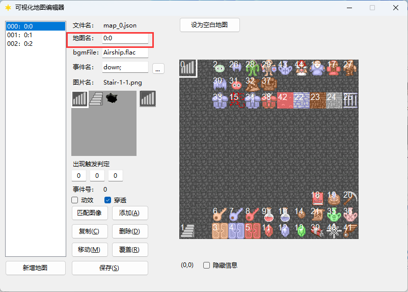

顾名思义，就是这个地图的名称，一般的魔塔楼层命名规则为 ``x:y`` ， ``x`` 是魔塔编号，默认从0开始， ``y`` 是楼层数。

满足此规则的将会在状态栏处显示 ``魔塔y层`` （可在 ``motaName.ini`` 处自行更改），不满足的将会显示本身设置的地图名，比如密室等。

### 地图BGM

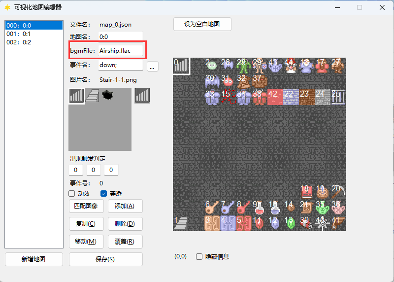

当前地图使用的BGM文件名，暂时不支持预览模式。

### 动效

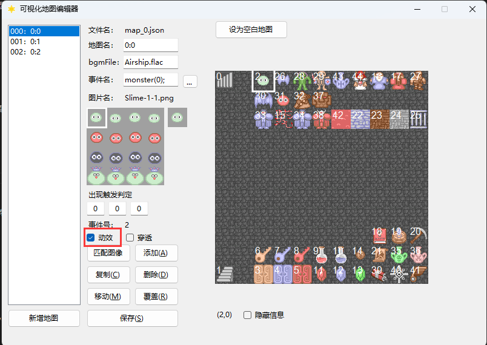

一般用于区分怪物/NPC事件和物品事件，对应RMXP的 `停止时动画` ，如果是怪物等，勾选上即可。

### 穿透

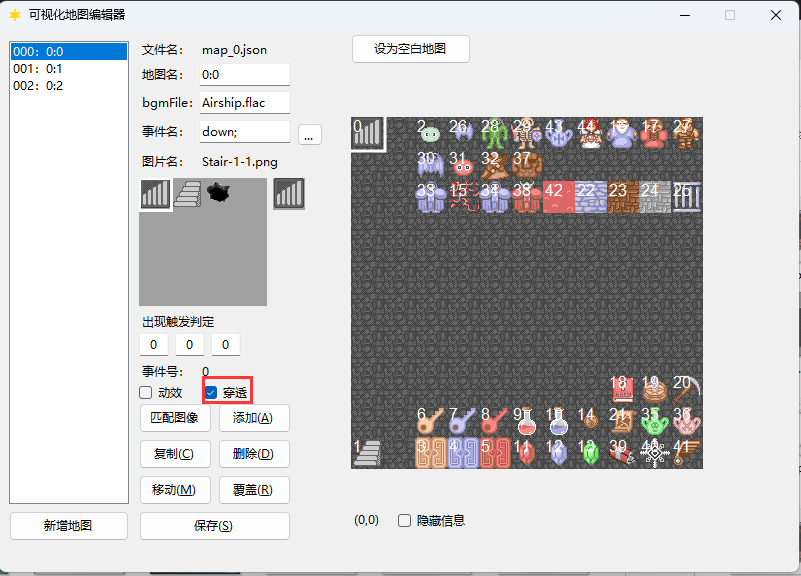

决定这个事件是否可以被穿过，一般用于楼梯、扣血路障等事件。

### 隐藏信息

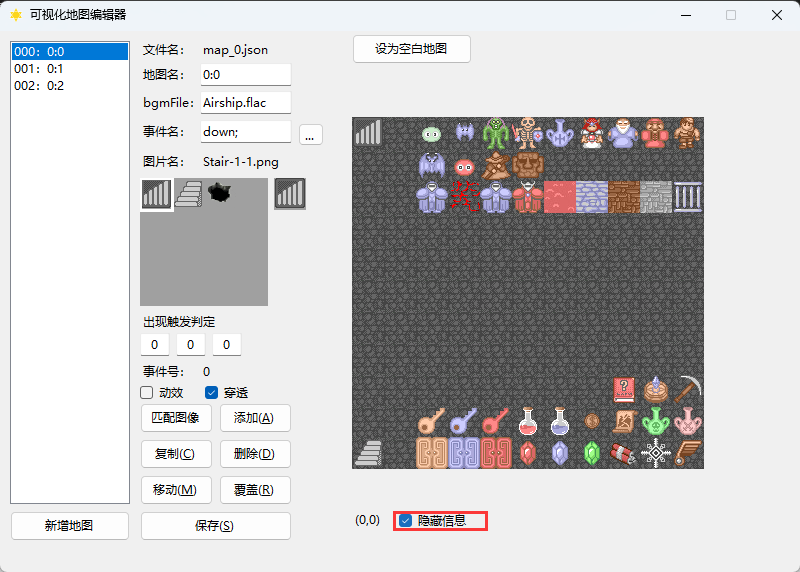

勾选可以隐藏在地图编辑器上显示的事件编号，更直观地看到在游戏中的样子。

### 匹配图像

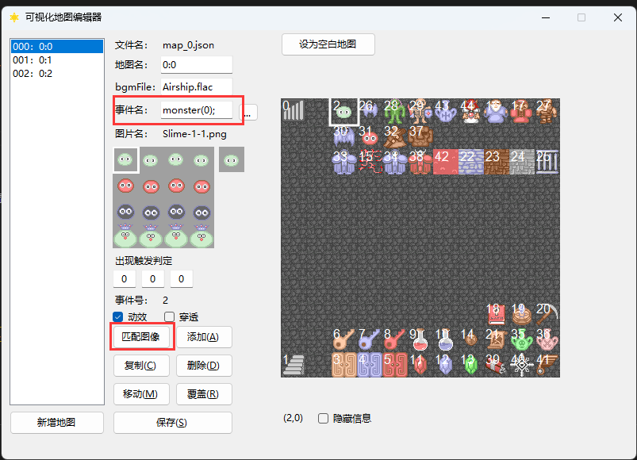

根据事件名匹配图像及其位置，会自动匹配的有monster、item事件，其余列表可以参考 ``DesignerReferrence.txt`` ，您可以按照格式自行更改。

### 添加事件

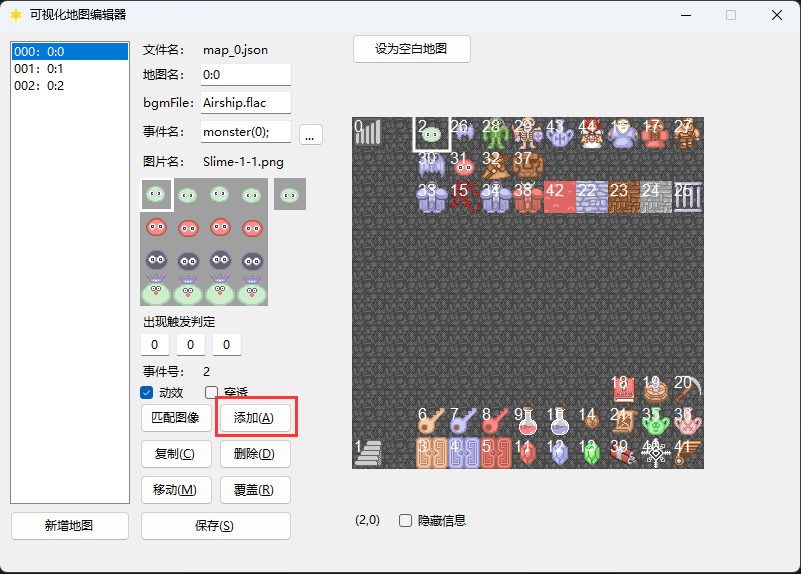

可以将左侧的事件信息添加到地图上选中的格子，也可以在 **地图上点击** `鼠标右键` 快速布置。

### 复制事件

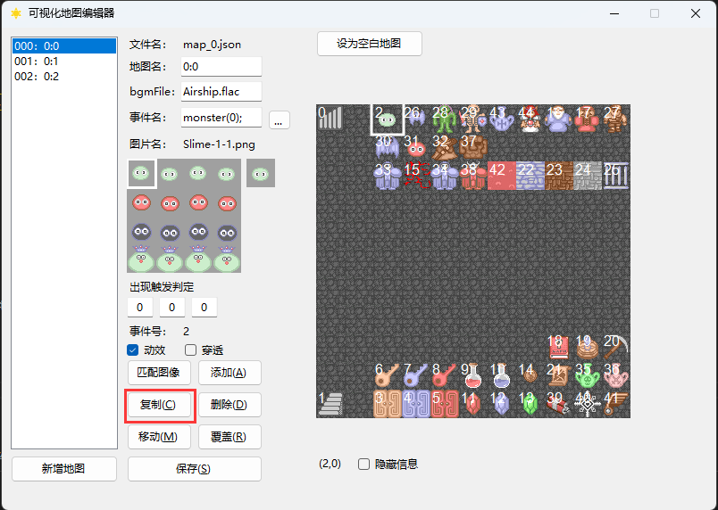

可以将地图上选中的格子的事件信息复制到左侧事件信息栏，同时也会显示复制的事件号，同时，在 **地图上点击** `鼠标左键` 即可快速复制。

### 删除事件

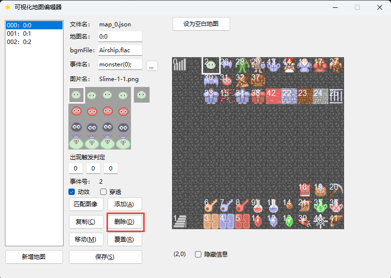

可以将地图上选中的格子的事件进行删除，后面的事件编号将会向前挪一位，也可以 **在地图上点击** `鼠标中键` 快速删除。

### 移动事件

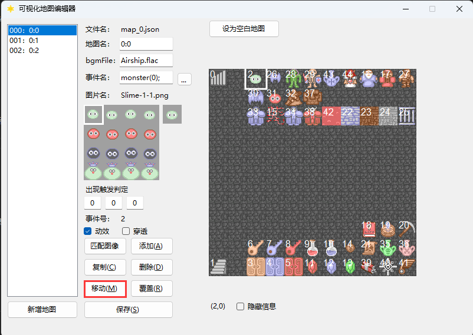

可以将复制事件号对应的事件移动到地图上选中格子的位置。

### 覆盖事件

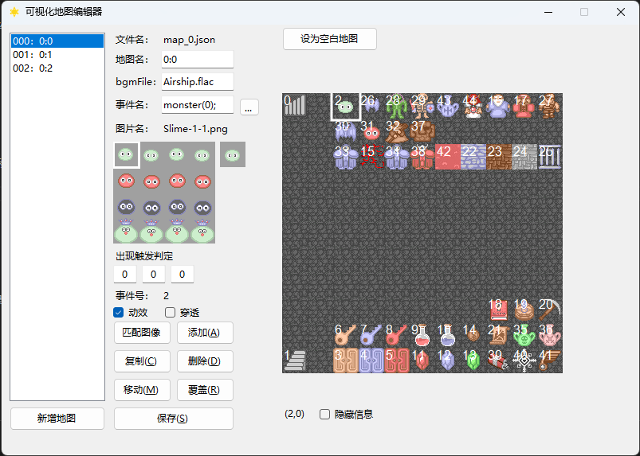

将选中的格子上的事件信息更改为左侧事件信息栏的内容。

### 保存

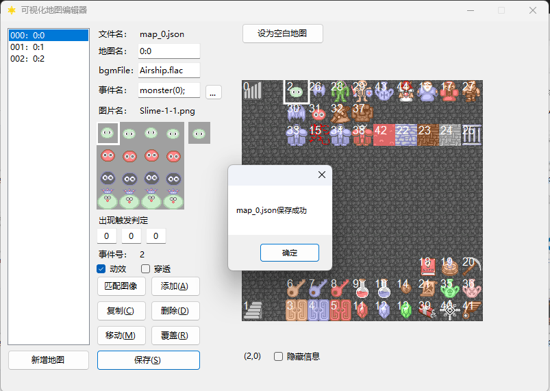

会保存 **当前页面** 的地图，保存成功后会弹出一个提示窗口。

### 新增地图 & 设为空白地图

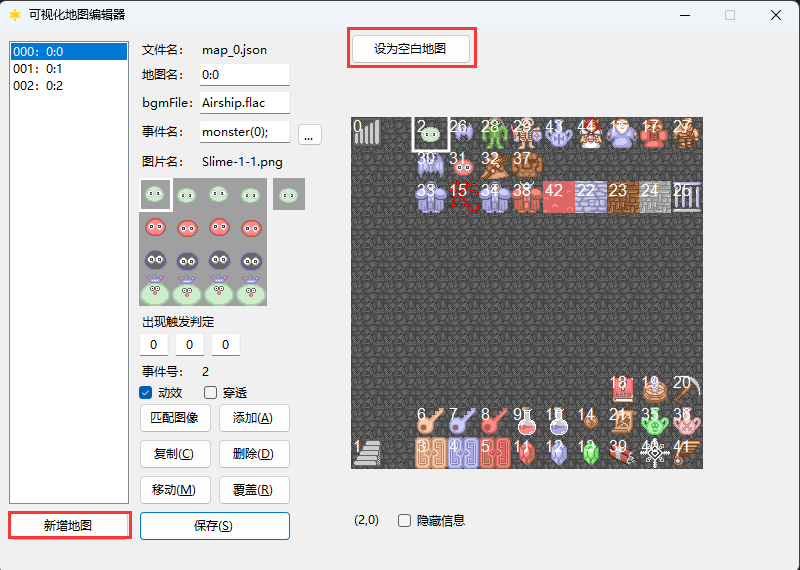

新增地图会在列表中新增一个地图，默认按照当前的空白地图模板 ``blankmap.dat`` 进行初始化。

设为空白地图会将当前地图的信息整合起来存入 ``blankmap.dat`` 。

## 动画编辑器AnimationDesigner.exe

这里可以对游戏动画进行绘制，支持的动画 **单个图片** 规格的动画素材（需要是透明底图）。


使用方法和RMXP的动画编辑器类似，不过极大简化了，每一帧的动画通过右上角按钮设置，默认的原点坐标都在中心点。

## RMXP动画素材分离器AnimationSeparator.exe

这里可以对RMXP规格的动画素材分离成若干192 * 192的素材，并保存在原路径中。


使用方法也很简单，导入 -> 点击分离，即可，在点击分离之后会自动将分离的素材放置到原路径中，文件名为 ``原文件名_x`` ， ``x`` 为下标，表示顺序。

  > 由于原RMXP的动画素材未必会填充满整行，所以可能出现保存了几个透明的空图片的情况，这种时候自行删除多余图片即可。

## 物品辑器ItemDesigner.exe

顾名思义，是用来编辑物品的工具，选择图片的操作方式参考地图编辑器。


## NPC对话编辑器NPCDesigner.exe

这里可以对游戏内NPC的对话内容进行设置。

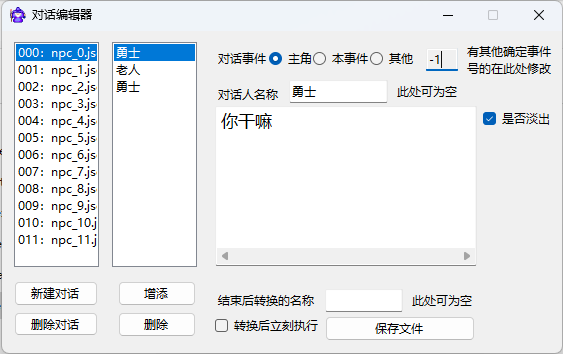

### 如何添加选择项？

选择项单起一行，在最前面加上 ``[s]`` ，代码就会识别出来这是选择项了，并且会出现光标矩形。

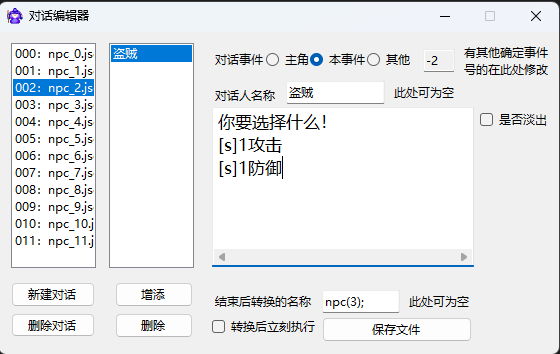

例如：

```
    你好，你要选择什么？
    [s]1攻击
    [s]1防御
```

### 选择项选中之后的对应指令要如何加上呢？

本框架所有事件指令均依托于事件名，在选择项内容描述完之后加上 ``=>`` ，多个事件用多个 ``=>`` 分隔，
然后写上需要执行的事件名，之后就会创建一个“临时事件”的列表并执行相关指令。

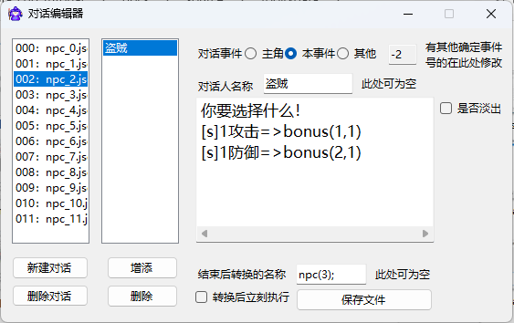

例如：

```
    你好，你要选择什么？
    [s]1攻击=>bonus(1,2)
    [s]1防御=>bonus(2,2)
```

### 何谓全角字符和半角字符？

举最简单的例子，所有的汉字和中文标点为 **全角** ，一般情况下的英文和数字字符为 **半角** 字符。

### 如何让半角字符转换为全角字符？

一般的输入法，全半角转换的快捷键为 ``shift+space`` ，微软拼音输入法打开快捷键的方法为：
 找到任务栏 `中/英` 字样 -> 右键点击 `选择设置` -> `按键` -> `全/半角切换` 。

### 禁用词

不允许在文字框内填写 ``none`` ，因为这个是占位用的，出现后会立刻跳出提示，对话框不允许在半角方括号 ``[]`` 内插入不合规文本。

### 事件编号

为本段对话中说话的对象编号，用来确认头像，当前主角说话为 ``-1`` ，当前触发事件为 ``-2`` ，这两项均可用按钮确认，会自动填写，其余情况为地图上对应的事件编号。

### 在对话中插入当前游戏某变量的值

在对话中插入 ``x`` 号变量的方法为写成 ``[vx]`` ，代码会自动识别半角方括号里的内容，并读取当前变量的值进行替换，例如12号变量就是 ``[v12]`` 。

在对话中插入当前游戏某物品的数量的方法为写成 ``[ix]`` ，代码会自动识别半角方括号里的内容，并读取当前物品的数量进行替换，例如12号物品就是 ``[i12]`` 。

在对话中插入角色各项能力数值的方法写成 ``[能力名称]`` ，列表如下所示：

| 能力名称 | 生命值 | 攻击力 | 防御力 | 魔防 | 经验 | 金币 | 等级 |
|---|---|---|---|---|---|---|---|
| 代表 | [hp] | [atk] | [def] | [mdef] | [exp] | [gold] | [lv] |

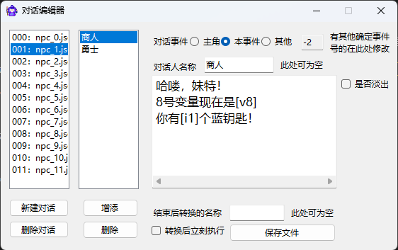

演示效果如下：

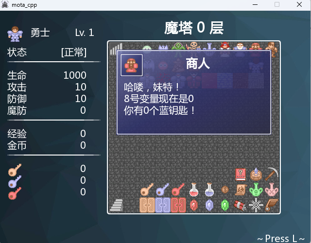

## 魔塔怪物编辑器EnemyDesigner.exe

这里可以对游戏内怪物的能力以及属性进行设置。

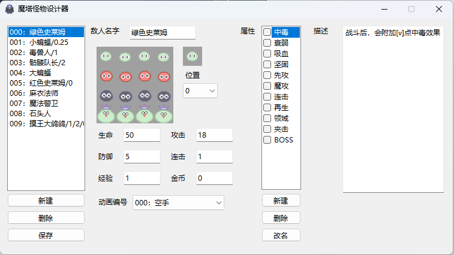

### 怪物名称格式

带有buff属性的怪物名称必须要以 ``/`` 分割，例如 ``绿史莱姆/1`` ， ``/`` 后面的内容代表buff的效果。

下面列出几种常见的buff效果及其命名格式：

| 效果 | 命名格式 |
|---|---|
| 中毒 | 整数，代表增加易伤的百分数 |
| 衰弱 | 整数，代表削减攻防的值 |
| 吸血 | 小数，代表吸血的百分比 |
| 再生 | 整数，代表复活成为的怪物编号 |

### 怪物属性

勾选想要赋予的属性即可，点击相对应栏可以查看其描述，直接在描述框修改描述即可。

对于带有数值的属性描述，比如 *战斗后，会附加若干点衰弱效果* ，这个 *若干点* 要替换为 ``[v]`` ，
在游戏中会按怪物属性从上到下读取，需要 ``[v]`` 的地方会读取怪物名称 ``/`` 分隔后第二个开始往后的数值。

比如怪物名设置为 ``红衣魔王/1/2`` ，拥有中毒和衰弱两个属性，属性描述均带有 ``[v]`` ，游戏中会自动将 ``1`` 设为中毒的 ``[v]`` ， ``2`` 设为衰弱的 ``[v]`` 。

### 打包工具Packager.exe

这个可以将你的工程打包为一个rar文件，要打包的项目可以在 ``package.txt`` 里面进行设置。

其中，文件夹需要以 ``\`` 结尾，文件则无要求。
